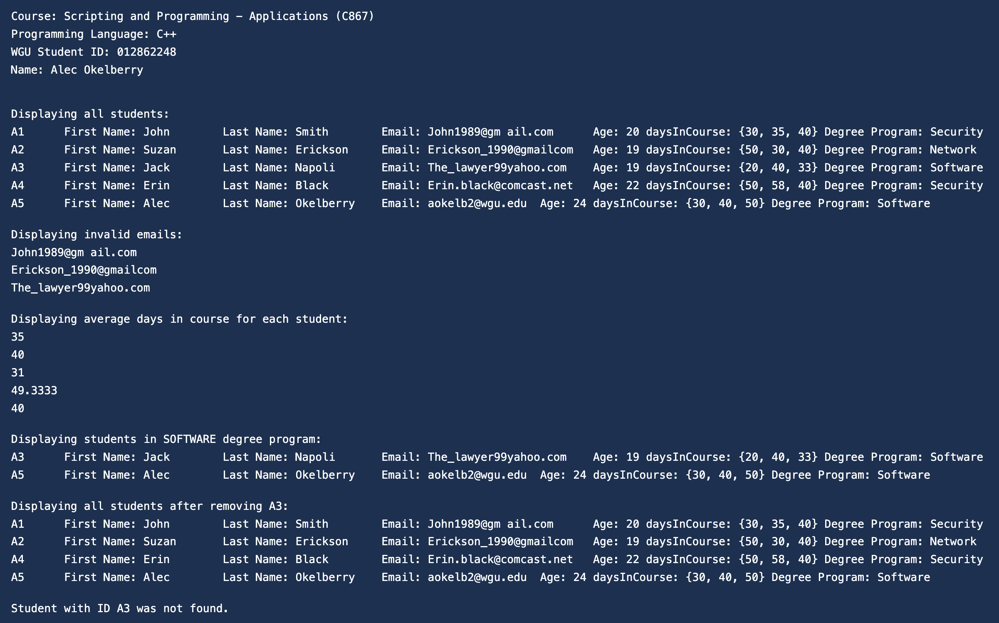

# WGU Class Roster

**Course**: C867 - Scripting and Programming - Applications  
**Language**: C++  
**Author**: Alec Okelberry

## Project Overview

This project is a console-based C++ application developed as part of the Western Governors University (WGU) Computer Science curriculum. It simulates the management of a class roster, demonstrating fundamental and intermediate concepts of Object-Oriented Programming (OOP), memory management, and data mapping in C++.

The program parses a comma-separated dataset of student information, populates an array of `Student` objects, and performs various operations such as targeted display filtering, data validation, and explicit memory cleanup.

## Features

- **Data Parsing & Instantiation**: Parses a dataset of comma-separated strings to instantiate `Student` objects and populate the class `Roster`.
- **Data Validation**: Iterates through student records to identify and display invalid email addresses based on strictly defined criteria (must contain exactly one `@`, one `.`, and no spaces).
- **Data Retrieval & Computation**: Uses accessors to retrieve numerical array data and calculates the average number of days each student spends across their courses.
- **Filtering**: Filters and displays students conditionally based on an enumerated variable type (`DegreeProgram`: Security, Network, Software).
- **CRUD Operations**: Dynamically adds and removes student records by ID and gracefully handles edge cases (e.g., when a queried record does not exist).
- **Strict Memory Management**: Uses an array of pointers to hold objects and relies on explicit class destructors to manually release memory, preventing memory leaks over the object lifecycle.

## Technical Concepts Demonstrated

- **Object-Oriented Programming**: Constructors, Destructors, Encapsulation, Classes, Accessors (getters), Mutators (setters).
- **Memory Management**: Pointers, references, dynamic memory allocation (`new`), and manual memory deallocation (`delete`).
- **Data Structures & Types**: Arrays, Enums (`enum`), Strings (`std::string`), size_t parameters.
- **Control Flow**: Finding substrings, iterative loops, conditional statements.

## Project Structure

- `main.cpp`: The application entry point; sequences the demonstration of all required roster operations.
- `degree.h`: Defines the `DegreeProgram` enumerated type.
- `student.h` & `student.cpp`: The `Student` class declaration and implementation, containing individual student attributes and member functions.
- `roster.h` & `roster.cpp`: The `Roster` class declaration and implementation, dealing with array management and bulk operations across all active students.

## How to Build and Run

1. **Compile the source files**:
   Ensure you have a C++ compiler (such as `g++` or `clang++`) installed. Open your terminal in the project directory and run:

   ```bash
   g++ -std=c++11 main.cpp roster.cpp student.cpp -o class_roster
   ```

2. **Execute the program**:
   ```bash
   ./class_roster
   ```

## Author Notes

This application acts as a foundational portfolio piece highlighting proficiency in reading structured data, managing objects in a strictly typed language, handling pointer safety/memory management, and writing well-encapsulated class files.

## Sample Output



## What I Learned

This project strengthened my understanding of C++ memory management and object lifecycle, particularly proper RAII principles and avoiding common pointer pitfalls like memory leaks and dangling pointers.
